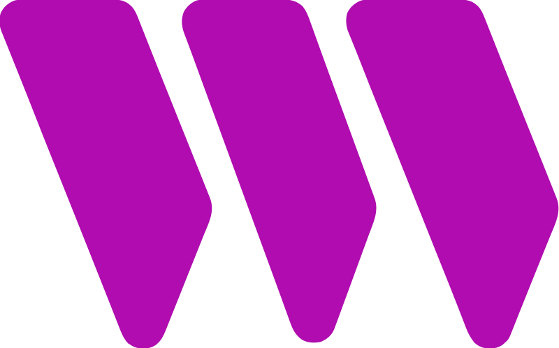

## RIDAN HAWY

Forging the decentralized future, one line of code at a time. As a seasoned full-stack developer, I'm now channeling my expertise from traditional web to the blockchain, building the infrastructure and interfaces for Web3. Let's connect and build something revolutionary.

# Skills

## 🧠Languages 

  

## ⚙️Tools

  

## 🕸️Web3

  
  
  
  
 

# GitHub Stats

# Support My Work

