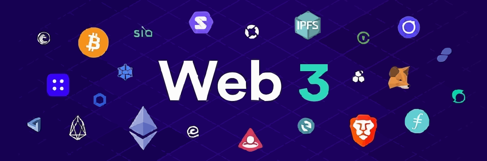
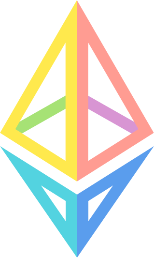
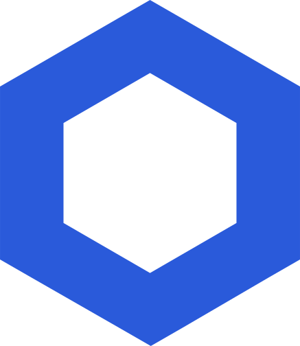

## RIDAN HAWY

Forging the decentralized future, one line of code at a time. As a seasoned full-stack developer, I'm now channeling my expertise from traditional web to the blockchain, building the infrastructure and interfaces for Web3. Let's connect and build something revolutionary.

## Languages & Tools'

  

  

  
  
  
  

## GitHub Stats

## Support Me

